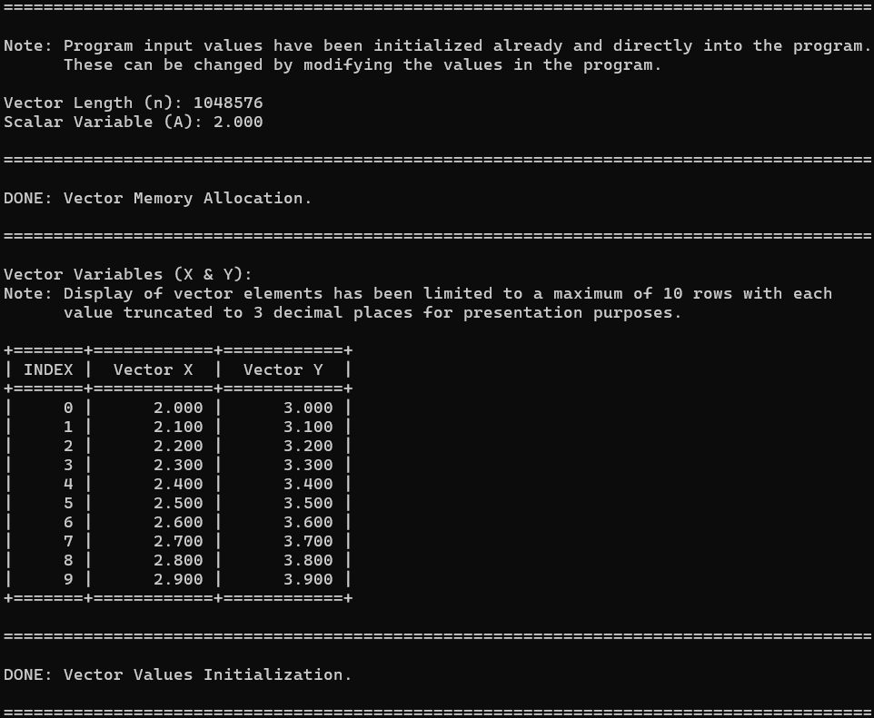
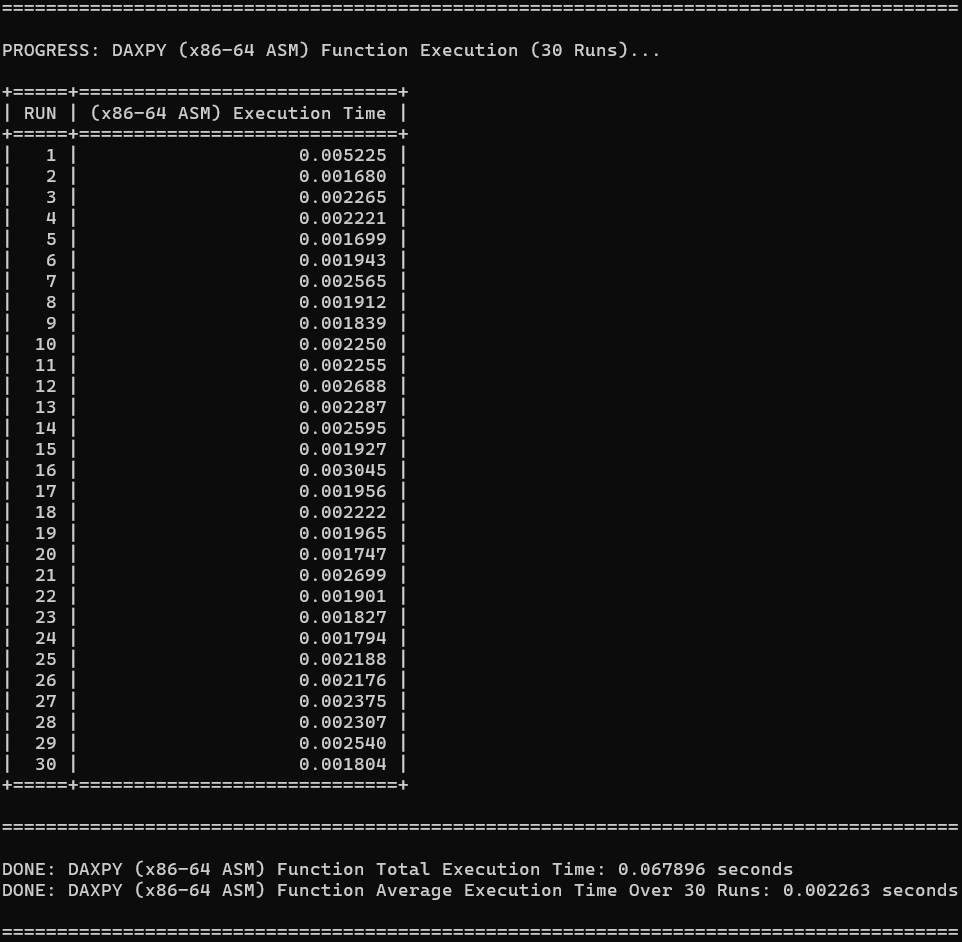
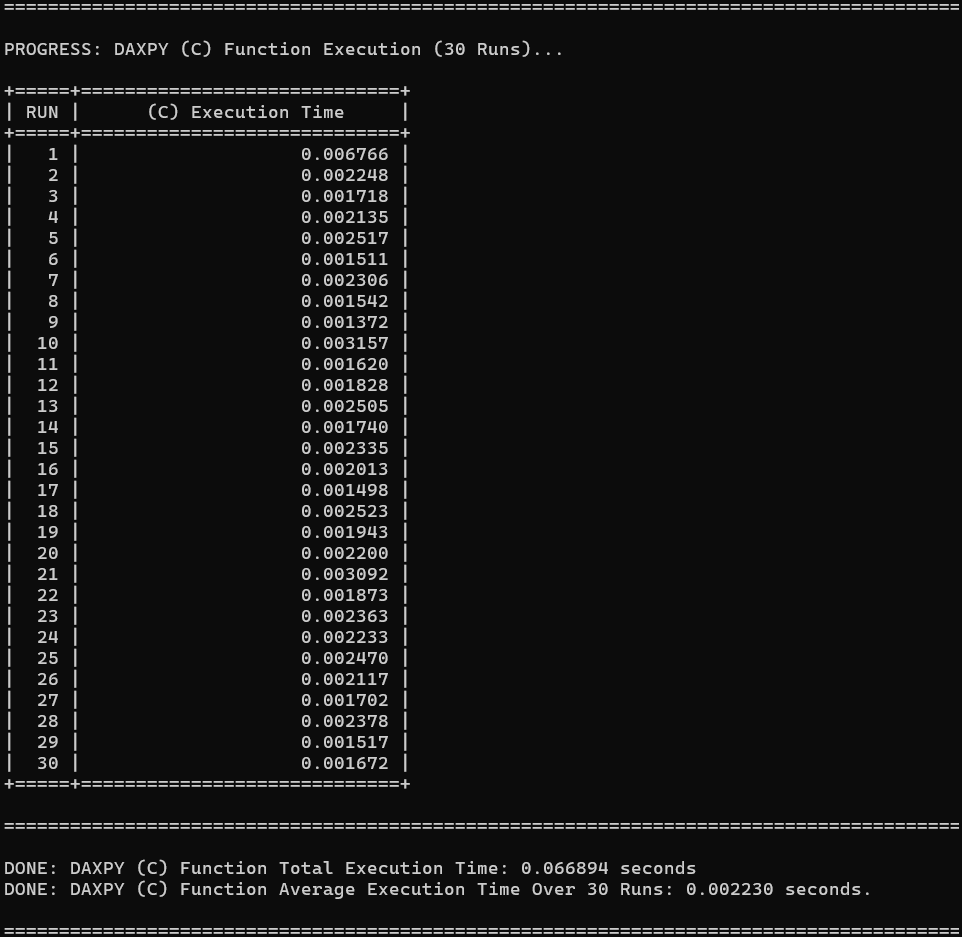
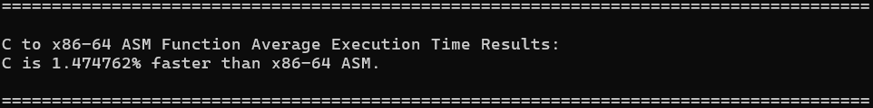
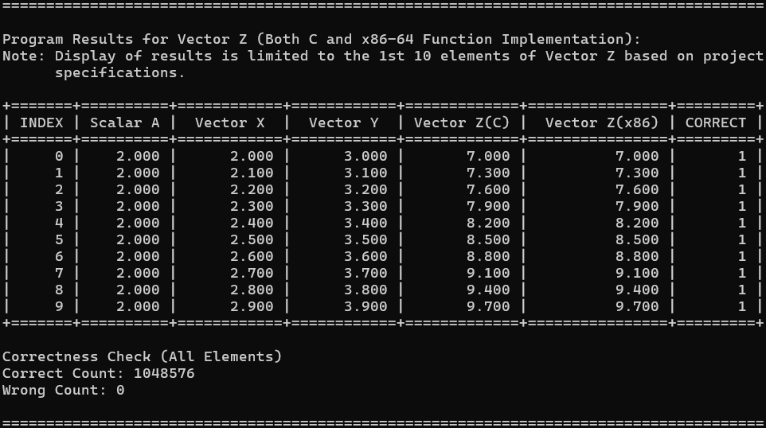

# [LBYARCH] MCO2: x86-to-C Interface Programming Project
* **Specifications:** [DAXPY (Double-precision A·X Plus Y)](./Project%20Specifications.pdf)
* **Course & Section:** LBYARCH - S20A
* **Developer:** Burayag, Ethan Axl S.

## Overview  
This project implements the DAXPY (Double-precision A·X + Y) kernel, forming a linear combination of two input vectors using a scalar multiplier. This is defined as:

```
Z[i] = A·X[i] + Y[i]
```

Where:
- **X, Y, and Z** are double-precision floating-point vectors  
- **A** is a double-precision scalar constant multiplier
- **0 ≤ i < n**, where **n** is the vector length  

This kernel is implemented and executed using two different programming approaches:

- **Standard C implementation**  
- **x86-64 Assembly implementation**, using scalar SIMD floating-point instructions  

The program measures and compares execution performance between both implementations using high-precision timing via `QueryPerformanceCounter()`. Each implementation is executed **30 times**, and average timings are computed to ensure reliable comparison.  

Finally, the program performs output correctness verification by comparing the C and assembly results element-by-element to ensure computational accuracy.

## Development Environment  
This project was created, developed, and tested using the following tools and configurations (as discussed in laboratory sessions):

- **NASM** — for assembling x86-64 assembly source  
- **TDM-GCC (MinGW-w64)** — for compiling the C source code and linking with assembly object files  
- The following executables are included in the system PATH:  
  - `nasm.exe`  
  - `gcc.exe`  
- **build.bat** — a batch script used to automate assembly, compilation, linking, and execution  

## Installation, Compilation, & Execution  
1. Download or clone the complete project folder onto your local machine.  
2. Ensure that **NASM** and **GCC** are installed and accessible through the system PATH.  
3. Open the `src` directory and run `build.bat` (either double-click it or execute via terminal).  
   This script will:  
   1. assemble the x86-64 assembly source, 
   2. compile the C source,  
   3. link both object files into a single executable, and  
   4. automatically run the final program.  

## Disclaimer
The program uses pre-initialized input values for reproducibility during execution and testing. These values (vector size, scalar constant, and vector elements) can be modified and changed directly inside the C file if desired.

## Program Execution Output
The program execution below explains and shows the flow and sample output of the program:

---

### Input Values Initialization  
This section displays the initialized input values for the program, including the vector length (`n`), the scalar constant (`A`), and the contents of vectors `X` and `Y`.  
For readability, only the 1st 10 elements of each vector are shown in the program output.  
*(For this sample run, `n = 2^20`.)*  



---

### x86-64 Kernel Execution  
This section shows the execution of the DAXPY kernel using the x86-64 assembly implementation.  
The program performs the kernel execution **30 times**, records each execution time, and then calculates the total and average execution duration.  



---

### C Kernel Execution  
This section shows the execution of the DAXPY kernel using the C implementation.  
Similar to the assembly execution, the kernel is run **30 times**, with execution times captured for each run, along with total and average runtime.  



---

### Execution Time Comparison  
This section presents the computed speedup comparison between the C and x86-64 implementations.  
The detailed interpretation and performance analysis will be discussed in the next section of this document.



---

### Output Correctness Check
This screenshot displays a result-by-result correctness check between the C and x86-64 outputs.  
The program compares each element of `Z_C[i]` and `Z_x86[i]` to ensure mathematical equality.  
In the correct column:  
- `1` indicates values match  
- `0` indicates a mismatch  

Per the project specifications, only the 1st 10 elements need to be displayed in the program.



## AI Declaration
* ChatGPT was used as assistance in improving project documentation report.


